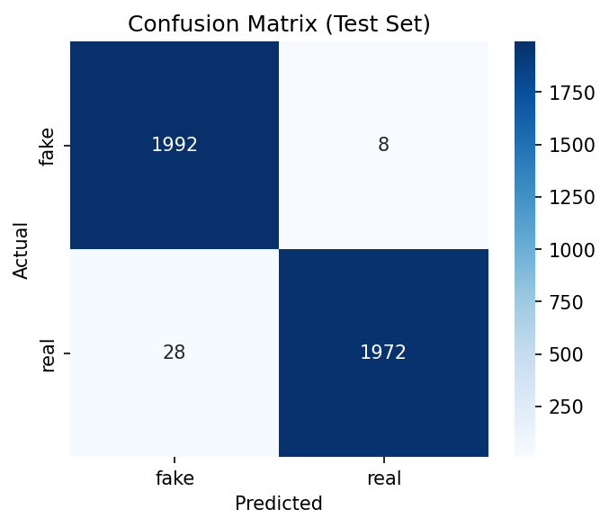
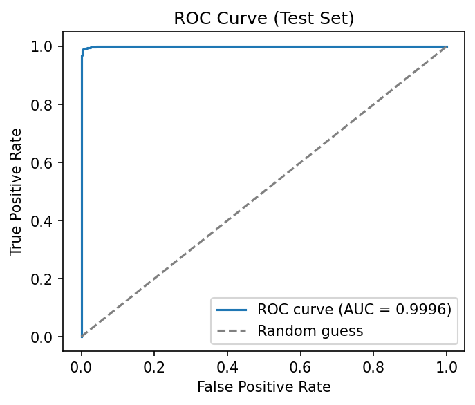

# DeepFake Detection using AI

Two specialized deep learning models for detecting AI-manipulated faces:
1. **GAN-Image Detector** — identifies AI-generated (StyleGAN) portrait images
2. **Face-Swap Detector** — identifies real video face-swap forgery (FaceForensics++)

Built end-to-end: data pipeline, model training, evaluation, explainability (Grad-CAM), video analysis, and deployment.

## Live Demo

**Deployed app:** https://deepfake-detector-vux8.onrender.com

This runs on free-tier hosting (512MB RAM, shared CPU), so it's a showcase of the deployed system rather than a full-speed demo — expect a slow cold start (~1 minute) and only the Face-Swap Detector is included live, to fit within memory constraints.

For the complete experience — both models, Grad-CAM explainability, full test-set evaluation, GPU-speed inference — see the training notebook below, or I'm happy to walk through a live demo directly.

**Full training notebook (both models, Grad-CAM, metrics):** https://www.kaggle.com/code/sanjai7117/deepfake-detection-effnet

## Results

### Model 1 — GAN-Image Detector
Trained on the [140k Real and Fake Faces](https://www.kaggle.com/datasets/xhlulu/140k-real-and-fake-faces) dataset (StyleGAN2-generated vs. real FFHQ faces).

| Metric | Score |
|---|---|
| Test Accuracy | ~99% |
| ROC-AUC | 0.9993 |

**Confusion Matrix:**


**ROC Curve:**


Grad-CAM shows the model's attention concentrated on the central facial region (nose, mouth, eye area) for both real and fake predictions — consistent with where GAN texture/blending artifacts typically appear. *(Full Grad-CAM visuals for this model are in the [training notebook](https://www.kaggle.com/code/sanjai7117/deepfake-detection-effnet).)*

### Model 2 — Face-Swap Detector
Trained on a subset of [FaceForensics++](https://github.com/ondyari/FaceForensics) (255 real + 255 manipulated videos, using the DeepFakes and FaceSwap methods specifically, since these perform identity replacement rather than expression reenactment). Split by video (not by frame) to prevent data leakage between train/val/test.

| Metric | Score |
|---|---|
| Test Accuracy | 91.58% |
| Precision | 0.9274 |
| Recall | 0.9022 |
| F1-score | 0.9146 |
| ROC-AUC | 0.9734 |

Grad-CAM shows attention on the eye/brow region for fake predictions (consistent with known face-swap blending-boundary artifacts) and on the nose/mouth region for real predictions — suggesting the model learned distinct, class-specific cues rather than a single fixed shortcut.

## Why Two Models?

"Deepfake" isn't one problem — GAN-generated portraits and video face-swap forgery have different artifacts and require different training data. Rather than force one model to do both, this project trains and evaluates two specialized detectors, and is upfront about each one's scope and limitations rather than overclaiming a single "universal" detector.

## Features

- **Image classification** with confidence scores for both models
- **Grad-CAM explainability** — visualizes which facial regions drove each prediction (full version in the notebook)
- **Video analysis** — samples frames from a video, detects and crops faces (MTCNN), classifies each frame, and aggregates into an overall verdict with a confidence-over-time chart
- **Interactive Gradio interface**

## Tech Stack

- **PyTorch / torchvision** — model training and inference (EfficientNet-B0, transfer learning from ImageNet)
- **OpenCV, MTCNN (facenet-pytorch)** — face detection and video frame processing
- **scikit-learn, matplotlib, seaborn** — evaluation metrics and visualization
- **Gradio** — interactive web interface
- **Render** — deployment

## Project Structure

deepfake-detector/
├── models/
│ ├── best_model.pth # GAN-image detector checkpoint
│ └── best_model_faceswap.pth # Face-swap detector checkpoint
├── assets/ # Confusion matrices, ROC curves, Grad-CAM images
├── app.py # Gradio app (deployed version)
├── requirements.txt
└── README.md

The full training pipeline (data preprocessing, model training, evaluation, Grad-CAM generation) lives in the [Kaggle notebook](https://www.kaggle.com/code/sanjai7117/deepfake-detection-effnet) — `app.py` here is the lightweight inference-only version used for deployment.

## Running Locally

```bash
git clone https://github.com/sanjai7117/deepfake-detector.git
cd deepfake-detector
pip install -r requirements.txt
python app.py
```

## Limitations & Honest Notes

- **GAN-Image Detector** was trained specifically on StyleGAN2-generated faces. It does not reliably generalize to images from other generators (e.g., Midjourney, Stable Diffusion, DALL-E) — a well-documented limitation in deepfake detection research, not unique to this model.
- **Face-Swap Detector** was trained on a 255-video subset of FaceForensics++ (two manipulation methods: DeepFakes, FaceSwap). Larger-scale training on the full dataset and additional manipulation methods (Face2Face, NeuralTextures, FaceShifter) would likely improve generalization further.
- The **video pipeline** has been validated on genuine, unmanipulated footage; it has not yet been tested against a confirmed real-world deepfake video sample.
- The **live demo** runs a reduced version (single model, no Grad-CAM) to fit free-tier hosting memory limits (512MB RAM). The full dual-model, Grad-CAM-enabled version is demonstrated in the training notebook.

## Roadmap

- [ ] Train on the full FaceForensics++ dataset (all 5 manipulation methods)
- [ ] Test video pipeline against confirmed real-world deepfake samples
- [ ] Add frequency-domain features to complement spatial CNN features
- [ ] Explore cross-dataset generalization (Celeb-DF, DFDC)
